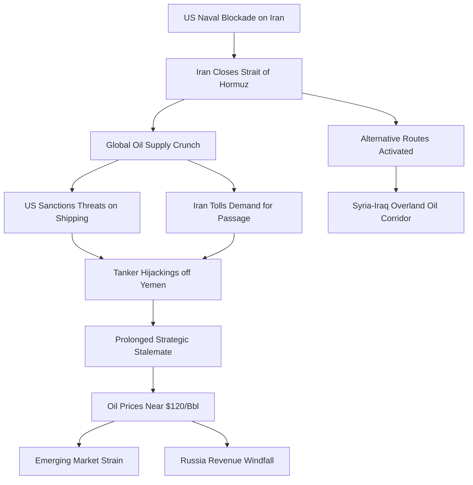
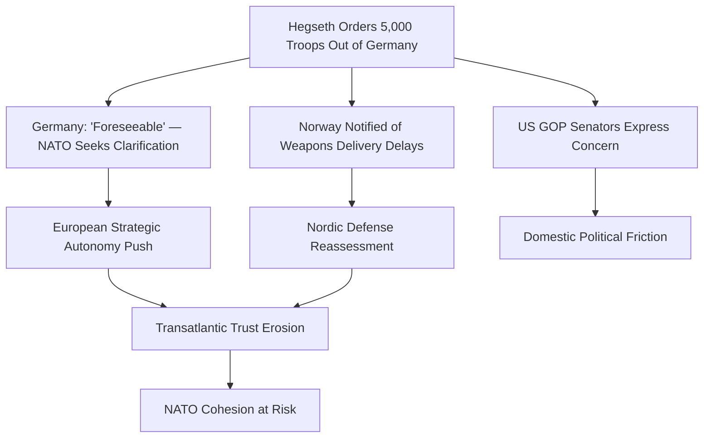

# Daily Intelligence Briefing — 2026-05-02

## BLUF (Bottom Line Up Front)

The global security environment continues to deteriorate across multiple theaters simultaneously. The Strait of Hormuz remains effectively closed for commercial traffic despite a nominal ceasefire, as US sanctions threats against shipping firms combine with Iranian toll demands to create an intractable logjam. US alliances face unprecedented strain: the withdrawal of 5,000 troops from Germany marks the most significant unilateral US force posture change in Europe since the Cold War, while Norway faces formal notification of weapons delivery delays. Israel-Lebanon ceasefire violations have escalated dramatically with 50+ airstrikes in 24 hours, killing 41 people. The UAE's decision to leave OPEC signals the beginning of the cartel's structural dissolution. Russia is benefiting from the global oil supply squeeze with surging revenues, even as the Iran conflict weakens Western diplomatic cohesion. **The cumulative effect is a systemic crisis of the post-WWII alliance architecture — not a series of isolated flashpoints.**

---

## 1. 🔴 US-Iran / Strait of Hormuz Crisis

### Key Judgment
The Strait of Hormuz closure is now a structural condition rather than a temporary disruption. The US is escalating pressure on third-party shipping firms with sanctions threats, while Iran's counter-proposal to focus on reopening the strait while deferring nuclear negotiations has been met with US skepticism. **Confidence: HIGH** — the convergence of military, economic, and diplomatic indicators all point toward prolonged closure.

### Current Assessment
President Trump signaled he is "not excited" by Iran's latest proposal for a peace deal. The US has directly threatened shipping firms with sanctions if they pay Iranian tolls for passage through the Strait. Meanwhile, an oil tanker has been hijacked off the coast of Yemen — the second such incident in 10 days — further disrupting maritime security in the region. Iran's currency has fallen to a record low against the US dollar, with air strikes and the American naval blockade battering the sanctions-hit economy.

Syria has emerged as an alternative energy corridor, receiving hundreds of Iraqi oil trucks hauling crude overland. The Stimson Center notes Goldman Sachs warnings of oil nearing $120 as the Iran war strains emerging markets.

### Escalation Chain

### Indicator Table

| Indicator | Current Status | Trend | Threshold | Assessment |
|-----------|---------------|-------|-----------|------------|
| Strait Commercial Traffic | Near-zero | → Stable | >50% of normal | Trigger not met |
| Iran Rial/Dollar Rate | Record low | ↓ Deteriorating | Below 500K/$ | In crisis |
| Oil Price (Brent) | ~$115-120 | ↑ Rising | $120 breach | Nearing threshold |
| Tanker Hijackings | 2 in 10 days | ↑ Increasing | 3rd incident | Elevated alert |
| US-Iran Talks | Stalled | → Flat | Resumption needed | Diplomatic limbo |
| Syria Overland Oil | Increasing | ↑ Growing | >100K bpd | Active mitigation |

---

## 2. 🔴 US Troop Withdrawal from Germany

### Key Judgment
Secretary Hegseth's order to withdraw 5,000 US troops from Germany represents the most significant unilateral force posture shift in Europe since the end of the Cold War. **Confidence: HIGH** — the order has been issued, announced, and publicly confirmed by Pentagon spokesman Sean Parnell.

### Current Assessment
Germany stated the withdrawal was "foreseeable" as NATO seeks clarification. Two senior Republicans in the US voiced concern over President Trump's decision. Norway has been formally notified by US authorities that weapons delivery delays "may occur," signaling broader erosion of US alliance reliability. The Pentagon statement cited "theater requirements and conditions on the ground" as rationale. This decision comes amid broader reassessment of American alliances, as highlighted by the Stimson Center's "Fit for Purpose?" analysis.

### Alliance Strain Cascade

---

## 3. 🟠 Israel-Lebanon Ceasefire Violations

### Key Judgment
The Israel-Hezbollah ceasefire is effectively non-functional. Israel launched 50 airstrikes on southern Lebanon in 24 hours, killing at least 41 people including four women and a child. **Confidence: HIGH** — confirmed by both BBC and Al Jazeera reporting, with casualty figures from the Lebanese health ministry.

### Current Assessment
A "double-tap" strike killed three rescue workers in a second wave targeting first responders. The expanded "orange line" in Gaza is deepening deadly no-go zones. Spain has demanded Israel release an arrested Gaza flotilla crew member. Turkey-Israel military-strategic rivalry continues to escalate, per SpecialEurasia analysis. The ceasefire framework, already fragile, is being consumed by operational realities on both fronts.

| Metric | Current | 24h Change | Assessment |
|--------|---------|-----------|------------|
| Airstrikes (S. Lebanon) | 50+ | ↑ Surge | Ceasefire breached |
| Casualties (24h) | 41 killed | ↑ Sharp rise | Humanitarian crisis |
| Ceasefire Status | Nominal | → Unravelling | De facto void |
| Gaza "Orange Line" | Expanding | ↑ Tightening | No-go zone growing |
| Rescue Workers Hit | 3 killed | Double-tap | Potential war crime |

---

## 4. 🟠 UAE Leaving OPEC

### Key Judgment
The UAE's decision to exit OPEC after nearly 60 years is a potential death knell for the oil cartel. **Confidence: HIGH** — reported by BBC and extensively analyzed by multiple intelligence outlets.

### Current Assessment
SpecialEurasia assesses the UAE's exit reflects a strategic pivot toward an axis with Israel, marginalizing Saudi and Iranian influence. The Stimson Center notes that the Iran war "instead of encouraging more cooperation, appears to have caused the opposite." This exit comes as global energy markets face unprecedented disruption from the Strait of Hormuz closure. The UAE's departure removes one of OPEC's largest producers, fracturing the collective bargaining mechanism that has defined global oil markets since 1960.

### Implications
- **Oil market fragmentation** — OPEC's discipline mechanism fatally weakened
- **UAE-Israel alignment** — New axis bypassing traditional Gulf security architecture
- **Saudi isolation** — Riyadh's leadership of OPEC severely compromised
- **Price volatility** — Without collective production management, wild price swings likely

---

## 5. 🟠 Taiwan Diplomatic Crisis

### Key Judgment
Taiwan's President visiting Eswatini days after blaming China for a cancelled trip represents a calibrated diplomatic challenge to Beijing. **Confidence: MEDIUM-HIGH** — the event is confirmed, but the full strategic context remains unclear.

### Current Assessment
China described the visit as a "stowaway-style escape farce." TheBoardWorld analysis highlights that Chinese state media messaging on Taiwan Strait tensions emphasizes Beijing's narrative of reunification and military signaling. This diplomatic incident coincides with broader US-China strategic competition, including North Korea dynamics following Wang Yi's visit to Pyongyang. The incident demonstrates Taiwan's willingness to maintain sovereign diplomatic engagement despite Chinese pressure.

---

## 6. 🟡 Cuba Sanctions

### Key Judgment
The Trump administration's new sanctions targeting broad sectors of the Cuban economy constitute the most aggressive unilateral measures against Cuba in decades. **Confidence: HIGH** — confirmed by both BBC and Guardian reporting.

### Current Assessment
Cuba's government has condemned the new measures as "collective punishment" and "illegal and abusive." The sanctions come on top of a US blockade of oil to Cuba that has already caused widespread blackouts and fuel shortages. An enormous 1 May procession outside the American embassy in Havana demonstrated domestic opposition. The measures target energy, defense, and mining sectors — a comprehensive economic warfare approach.

---

## 7. 🟡 Russia Oil Revenue Surge

### Key Judgment
Russia is benefiting from the global oil supply crisis triggered by the Strait of Hormuz closure, with oil revenues surging despite existing Western sanctions. **Confidence: HIGH** — reported by OilPrice.com with supporting data.

### Current Assessment
While Europe and the US have been decreasing dependence on Russian energy, the global scramble for supply is driving up prices and enabling Russian revenue growth. Russia-Iran cooperation has reached "strategic depth" according to SpecialEurasia, encompassing intelligence sharing and military-technical integration. Ukraine is monitoring Belarus border activities as Russian strikes persist. The confluence of Hormuz disruption, OPEC fragmentation, and Russian-Iranian alignment is creating an energy security crisis that Western sanctions regimes cannot contain.

| Factor | Impact on Russia | Confidence |
|--------|-----------------|------------|
| Oil price surge ($115-120/bbl) | Direct revenue increase | HIGH |
| Hormuz disruption | Reduces competing supply | HIGH |
| OPEC fragmentation | Reduces coordinated output | MEDIUM |
| Western sanctions | Increasingly ineffective | HIGH |
| Russia-Iran axis | Strategic depth gained | MEDIUM-HIGH |

---

## Cross-Cutting Assessment

### Key Judgment
The simultaneous crises across the Strait of Hormuz, European alliance structure, Levant, and global energy markets are not coincidental — they reflect a systemic degradation of the post-1945 international order. The US is simultaneously managing an active conflict with Iran, a NATO alliance crisis, a fragile Mideast ceasefire, and an increasingly transactional approach to alliances that is eroding trust from Berlin to Oslo.

### Indicator Dashboard

| Indicator | Status | Trend | Priority |
|-----------|--------|-------|----------|
| Hormuz closure | Active | Stable | 🔴 CRITICAL |
| US-Europe alliance health | Eroding | Worsening | 🔴 CRITICAL |
| Israel-Lebanon ceasefire | Failing | Worsening | 🟠 HIGH |
| Global oil price | $115-120 | Rising | 🟠 HIGH |
| OPEC integrity | Fracturing | Worsening | 🟠 HIGH |
| Taiwan strait tensions | Elevated | Stable | 🟡 MODERATE |
| Cuba humanitarian crisis | Severe | Worsening | 🟡 MODERATE |
| Russia revenue surge | Active | Growing | 🟡 MODERATE |
| Sudan conflict | Ongoing | Fluctuating | 🟢 LOW |
| Brazil flooding | Active | Worsening | 🟢 LOW |

### Watch Items (Next 72 Hours)
1. **Iran peace proposal response** — Trump's rejection signals potential escalation
2. **NATO Germany response** — Official alliance position on US withdrawal
3. **Lebanon ceasefire collapse** — Full resumption of hostilities possible
4. **Oil price breach of $120** — Would trigger economic shockwaves in emerging markets
5. **Taiwan-Eswatini follow-on** — Chinese retaliatory measures expected

---

*Analysis prepared by TREVOR Intelligence — 2026-05-02 20:39 UTC*
*Sources: BBC World, BBC Middle East, Al Jazeera, Guardian, Breaking Defense, OilPrice.com, Stimson Center, SpecialEurasia, Substack analysts*
