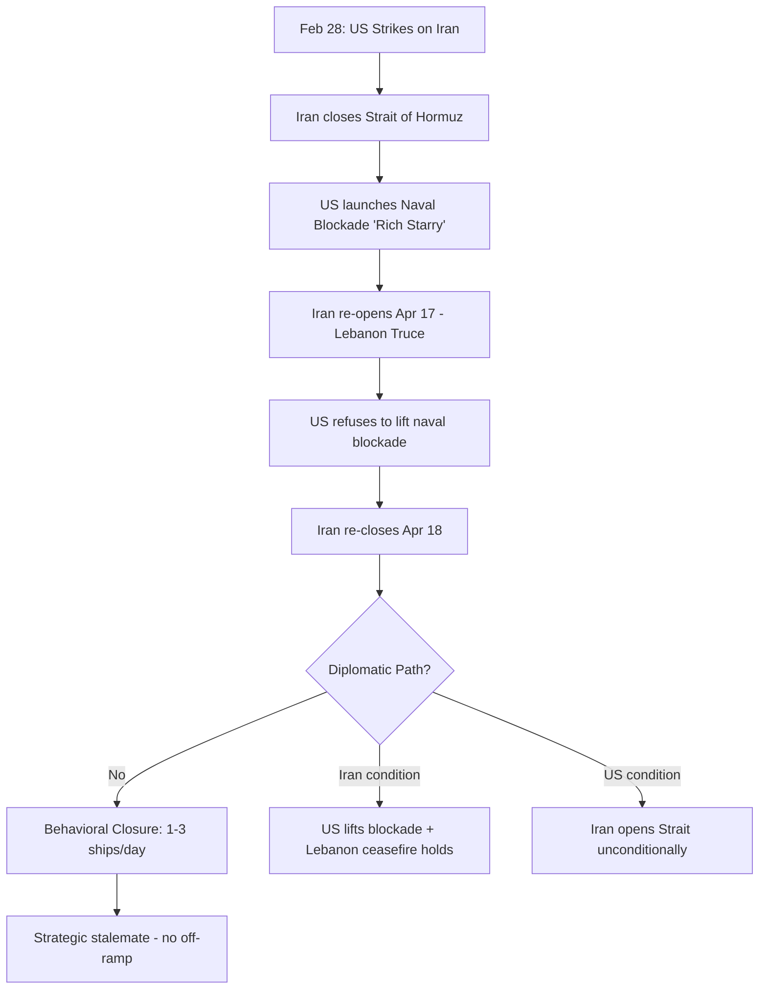
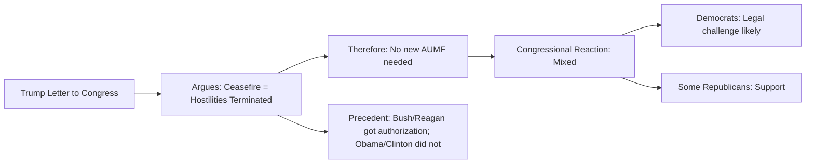

# TREVOR Global Intelligence Briefing
**Date:** 2026-05-02 | **Time:** 12:00 UTC
**Classification:** UNCLASSIFIED // FOR OFFICIAL USE ONLY
**Prepared by:** TREVOR (Threat Research & Evaluation Virtual Operations Resource)

---

## BLUF

Seven interconnected developments dominate: (1) the Strait of Hormuz dual-blockade persists with no diplomatic off-ramp, (2) US-Iran constitutional crisis escalates over war powers, (3) Israel-Lebanon ceasefire frays with deadly strikes, (4) US-Germany alliance fractures over troop cuts, (5) global energy markets enter structural dislocation, (6) US domestic aviation sector faces collapse, and (7) the Pentagon signals a doctrinal shift to AI-first warfare.

---

## 1. ⚓ Strait of Hormuz — Dual Blockade Persists

**Assessment:** The Iran-US dual-blockade remains the highest-impact global security event. No diplomatic resolution imminent.

### Current State

- **Iranian side:** "Behavioral closure" — ~1-3 transits/day vs. 40/day pre-crisis. Iran maintains a selective toll system for sanctioned operators.
- **US side:** Operation 'Rich Starry' — 100+ aircraft, 12+ warships, 45+ vessels intercepted since Apr 13.
- **Iran's condition for reopening:** US must lift naval blockade. US refuses. Iran re-opened briefly Apr 17 during Lebanon truce, re-closed Apr 18.
- **Key development:** Iran now conditions reopening on holding of US-brokered Israel-Hezbollah ceasefire, linking the two theaters.

### Key Metrics

| Indicator | Pre-Crisis | Current | Change |
|-----------|-----------|---------|--------|
| Daily transits (Hormuz) | 40 | 1-3 | -95% |
| Brent crude | ~$75/bbl | ~$88/bbl | +17% |
| LNG TTF (Europe) | baseline | +35% | Severe |
| LNG JKM (Asia) | baseline | +51% | Critical |
| Insurance (Gulf) | 1x | 5x | +400% |
| Seafarers stranded | 0 | 20,000 | N/A |
| US SPR released | — | 17.5M bbl since Mar 20 | 7.1M bbl/week |

---

## 2. ⚖️ US-Iran War Powers: Constitutional Crisis Escalates

**Assessment:** Trump's claim that the ceasefire terminates congressional war powers is legally contested and strategically significant.

**Key development (May 1):** Trump sent Congress a letter arguing that because "hostilities have terminated" under the Iran ceasefire, the 2001 AUMF no longer applies and he does not need congressional approval for renewed military action against Iran.

**Analytical note:** This is a pre-positioning move. If the ceasefire collapses, Trump can claim legal standing to strike Iran without Congress. Expect legal challenges from Democratic leadership + constitutional scholars. The mixed historical record (both Bushes and Reagan sought and received authorization; Obama and Clinton did not for Libya/Kosovo) means this is not settled law.

### US-Germany Link

**US to cut 5,000 troops from Germany** — announced amid escalating Trump-Merz row over Iran policy. Germany has been one of the most vocal European critics of US strategy in the Gulf. This represents the most significant US force posture change in Europe since the Cold War drawdown.

---

## 3. 💥 Israel-Lebanon: Ceasefire Fraying

**Assessment:** The US-brokered ceasefire between Israel and Hezbollah is under severe strain. 13 killed in Israeli strikes on southern Lebanon (May 2), including 4 women and a child.

**Significance:** Iran explicitly linked the Lebanon ceasefire to Hormuz reopening. If this ceasefire collapses entirely, expect:
1. Immediate Iranian re-closure of Hormuz (already functionally closed)
2. Escalation of Hezbollah rocket fire into northern Israel
3. Potential for a two-front conflict for Israel

**Current status:** Hezbollah has not formally withdrawn from border areas. Israeli strikes continue against what they describe as Hezbollah infrastructure violations. The "ceasefire" is increasingly a framework for limited retaliation rather than an actual cessation of hostilities.

---

## 4. 🏭 Global Energy Markets: Structural Dislocation

**Assessment:** The Hormuz closure has triggered a multi-layered energy crisis that is now structurally embedded, not a temporary spike.

### LNG Crisis

- **Divergence:** TTF (Europe) +35%, JKM (Asia) +51%, Henry Hub (US) -9%
- **QatarEnergy force majeure:** Declared Mar 4; 82% of Qatari gas sales to Asia affected
- **Zero laden LNG vessels crossed Hormuz** Mar 1–Apr 24 (Kpler data)
- **US LNG exports at max:** 94% terminal utilization in March; 17.9 Bcf/d

### Oil Markets

- **Brent backwardation:** Dated Brent at $25+/bbl premium over futures — extreme physical tightness
- **IEA coordinated release:** 400M bbl from member countries
- **SPR drawdown accelerating:** 17.5M bbl released since Mar 20, largest weekly draw since Oct 2022
- **No strategic reserves can sustain this indefinitely**

### Maritime/Insurance

- Insurance costs 5x normal; war risk coverage being selectively canceled in the Gulf
- DFC $20B reinsurance backstop announced but not yet executable
- 20,000 seafarers stranded, creating a humanitarian dimension

**Assessment:** This is no longer a "supply shock" — it is a structural re-routing of global energy flows. Asia is being disproportionately affected (JKM +51%). The US is comparatively insulated (HH -9%) due to domestic production. Europe sits in the middle.

---

## 5. ✈️ Spirit Airlines: Collapse of a US Carrier

**Assessment:** Spirit Airlines shutting down after rescue talks with Trump administration collapsed. $500M bailout rejected.

**Significance:**
- First major US airline failure since the industry consolidation era
- Signals broader distress in the low-cost carrier model (labor costs, fuel volatility, consolidation pressure)
- 23,000+ employees affected
- Trump admin's refusal signals shift away from pandemic-era bailout precedent

**Watch for:** Contagion to other low-cost carriers (Frontier, Allegiant, JetBlue). The post-Hormuz fuel price environment makes this an especially bad time for fuel-intensive budget operations.

---

## 6. 🤖 Pentagon: Doctrinal Shift to 'AI-First' Warfare

**Assessment:** Pentagon announces the US military will become an "AI-first" fighting force, signing 8 new contracts with major tech firms.

**Key implications:**
- Doctrine shift mirrors the 1990s "Revolution in Military Affairs" but compressed in time
- Likely focus areas: autonomous targeting, logistics optimization, intelligence fusion, drone swarm coordination
- Contract beneficiaries likely include Palantir, Anduril, Microsoft, Google (via Project Maven lineage)
- Raises ethical/Law of Armed Conflict questions — autonomous weapons decision-making

**Assessment:** This is a structural change, not incremental. The US military is betting that AI integration is the decisive asymmetric advantage in a future conflict (likely shaped by lessons from Ukraine and the current Iran crisis).

---

## 7. 📊 Other Notable Developments

| Event | Significance | Trend |
|-------|-------------|-------|
| May Day protests (US cities) | Worker/immigrant rights — broad mobilization | Monitoring |
| Trump: 25% tariffs on EU cars | Escalating trade war; 15% currently under deal | ⬆️ |
| US court limits mifepristone access | Abortion pill mail-order restricted | ⬆️ legal |
| Cuba condemns new US sanctions | "Illegal and abusive" — no policy change expected | → |
| London anti-Semitic attack aftermath | Jewish community on alert | ⬆️ tension |
| Princess Charlotte 11th birthday | Royal interest item — no intel value | — |

---

## Key Assessments

1. **Hormuz blockade most likely persists through Q2 2026** (60-70%) — no diplomatic off-ramp visible; both sides have hardened positions
2. **Israel-Lebanon ceasefire will not hold** (55-65%) — pattern of violations, no withdrawal mechanism, Iran-linked
3. **Oil will remain above $85/bbl** (65-75%) — structural tightness, SPR drawdown unsustainable
4. **Global LNG markets will bifurcate** (80%) — Asia paying heavy premium, US/Europe unevenly affected
5. **US-Europe alliance fracture deepens** (60%) — troop cuts + Iran policy divergence + tariffs

---

## Intelligence Gaps

| Gap | Priority | Action |
|-----|----------|--------|
| G1: Iran internal political dynamics (post-strike leadership) | HIGH | Monitor Iran International, IRGC signals |
| G2: Russia-Iran military logistics pipeline status | HIGH | Track Caspian Sea maritime traffic |
| G3: China-Iran oil barter volume | MEDIUM | Monitor dark fleet AIS anomalies |
| G4: Israel-Hezbollah negotiation channels | HIGH | Track US envoy activity |
| G5: SPR replenishment timeline | MEDIUM | Monitor DOE announcements |

---

*End of Briefing — TREVOR V3 Methodology Applied*
